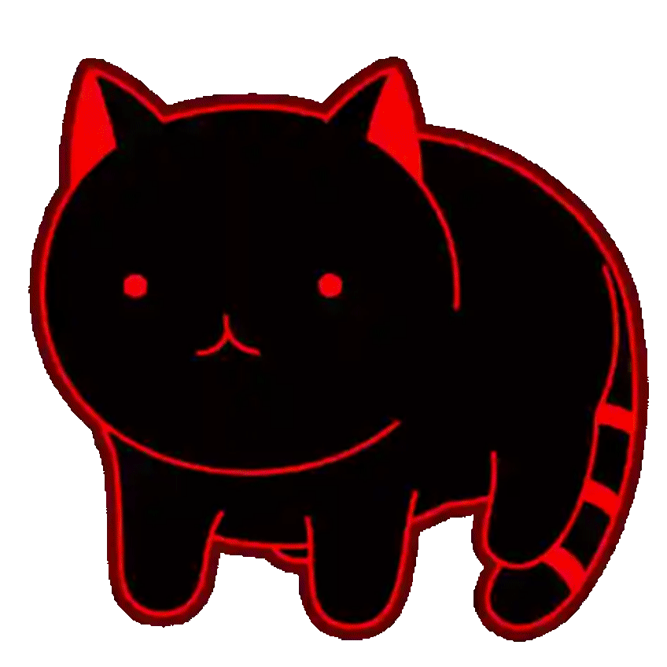

# Yo! You can call me Pucci Cat

From building web apps to engineering data pipelines. Currently grinding toward **Data Engineering ->-> AI/ML**.

Passionate about clean code, scalable systems, and teaching computers to understand language.

  

# Skills

  

  
  
  
  
  

  
  
  
  
  
  
  
  

  
  
  

  
  

  
  

  <picture>
  <source media="(prefers-color-scheme: dark)" srcset="https://raw.githubusercontent.com/Aungthukha20/Aungthukha20/pacman-output/pacman-contribution-graph-dark.svg">
  <source media="(prefers-color-scheme: light)" srcset="https://raw.githubusercontent.com/Aungthukha20/Aungthukha20/pacman-output/pacman-contribution-graph.svg">
  
</picture>
